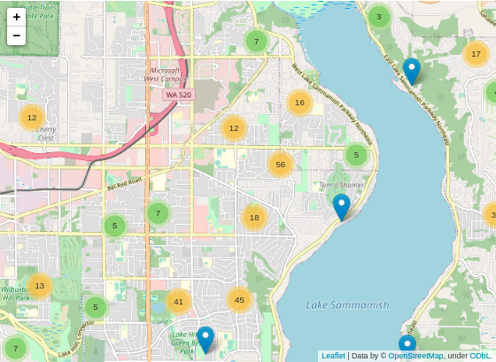
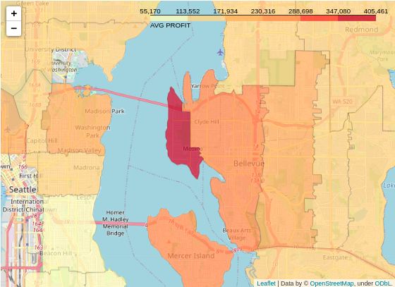
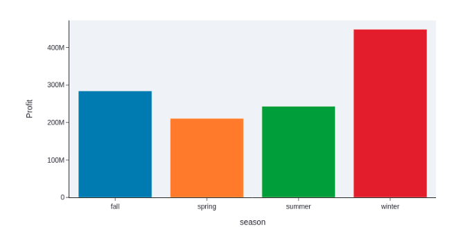

# Projeto de Insight: House Rocket
O objetivo desse projeto é fornecer para o time de negócios, uma seleção de imóveis, dadas as melhores condições, para que a empresa possa realizar suas operações de compra e venda. Os insights fornecidos neste projeto visam demonstrar um valor de lucro máximo que a empresa pode obter dado as condições que a mesma pode definir num segundo momento.

A ferramenta de visualização utilizada nesse projeto - Streamlit, permitirá que a empresa possa visualizar esse resultado de forma gráfica, tabular e através de mapas de localização.

O resultado geral obtido foi uma seleção de 10.505 imóveis (podendo ser variável de acordo com as condições/localizações) que corresponde a quase 50% dos imóveis do portfólio disponibilizado.

Assumindo que o time de negócios definiu os percentuais de 30% e 10% de margem  de lucro(conforme detalhes nos tópicos 1.4 e 2.2b, o lucro máximo que poderá ser obtido com as operações é de US$ 1.186.638.788.20

Link para visualização:

## 1. A House Rocket

### 1.1 Contexto do negócio:

A House Rocket é uma plataforma digital que tem como modelo de negócio, a compra e a venda de imóveis usando tecnologia.

O objetivo do case é fornecer insights para a empresa encontrar as melhores oportunidades de negócio no mercado de imóveis. O CEO da House Rocket gostaria de ***maximizar*** a receita da empresa encontrando ***boas oportunidades*** de negócio.

Sua principal estratégia é ***comprar boas casas*** em ótimas localizações com preços baixos e depois revendê-las posteriormente a preços mais altos. Quanto maior a diferença entre a compra e a venda, maior o lucro da empresa e portanto maior sua receita.

Entretanto, as casas possuem muitos atributos que as tornam mais ou menos atrativas aos compradores e vendedores e a localização e o período do ano também podem influenciar os preços.

### 1.1 Questão do negócio:

Considerando que:

O time do negócio não consegue tomar boas decisões de compra sem analisar os dados.
O portfólio é muito grande, muito tempo para fazer o trabalho manualmente.

O objetivo desse projeto é fornecer uma seleção de imóveis, dadas as melhores condições, para que a empresa possa realizar suas operações de compra e venda. 
O planejamento é demonstrar através de visualizações, quais as melhores oportunidades e qual resultado (lucro) máximo que pode ser alcançado.

Em suma, o projeto visa responder às seguintes perguntas de negócio:

- Quais são os imóveis que a House Rocket deveria comprar e por qual preço ?
 - Uma vez a casa comprada, qual o melhor momento para vendê-las e por qual preço ?

### 1.2 Sobre os dados:

Os dados foram extraídos do link abaixo, onde constam todos os imóveis em portfólio e disponíveis para a empresa.

https://www.kaggle.com/harlfoxem/housesalesprediction

Os atributos dos imóveis dentro do portfólio e seus respectivos significados, são os seguintes:

|***Atributo*** | ***Descrição*** |
| -------- | --------- |
|**id** | Numeração única de identificação de cada imóvel |
|**date** | Data da venda da casa |
|**price** | Preço que a casa está sendo vendida pelo proprietário |
|**bedrooms** | Número de quartos |
|**bathrooms** | Número de banheiros (0.5 = banheiro em um quarto, mas sem chuveiro) |
|**sqft_living** | Medida (em pés quadrado) do espaço interior dos apartamentos |
|**sqft_lot** | Medida (em pés quadrado)quadrada do espaço terrestre |
|**floors** | Número de andares do imóvel | 
|**waterfront** | Variável que indica a presença ou não de vista para água (0 = não e 1 = sim) | 
|**view** | Um índice de 0 a 4 que indica a qualidade da vista da propriedade. Varia de 0 a 4, onde: 0 = baixa 4 = alta | 
|**condition** | Um índice de 1 a 5 que indica a condição da casa. Varia de 1 a 5, onde:1 = baixo 5 = alta | 
|**grade** | Um índice de 1 a 13 que indica a construção e o design do edifício. Varia de 1 a 13, onde: 13 = baixo, 7 = médio e 1113 = alta | 
|**sqft_basement** | A metragem quadrada do espaço habitacional interior acima do nível do solo | 
|**yr_built** | Ano de construção de cada imóvel | 
|**yr_renovated** | Ano de reforma de cada imóvel | 
|**zipcode** | CEP da casa | 
|**lat** | Latitude | 
|**long** | Longitude | 
|**sqft_livining15** | Medida (em pés quadrado) do espaço interno de habitação para os 15 vizinhos mais próximo | 
|**sqft_lot15**| Medida (em pés quadrado) dos lotes de terra dos 15 vizinhos mais próximo | 

*Além do dataset acima citado, foi utilizado um arquivo geojson para a criação de mapas de densidade. A API foi extraída do site ArcGIS Hub.*

### 1.4 Premissas do negócio:

Dentro do processo de entendimento de negócio, exploração dos dados e decisão para fornecer os insights finais, foram adotadas as seguintes premissas:

- Os valores iguais a zero em *yr_renovated* são casas que nunca foram reformadas;
- O valor igual a 33 na coluna *bathroom* foi considerada um erro e por isso foi delatada das análises. Possivelmente poderia ser um erro de digitação, mas por falta dessa clareza, a exclusão foi optada;
- A coluna *price* significa o preço que a casa foi ou será comprada pela empresa House Rocket;
- Valores duplicados em *id* foram removidos e considerados somente a compra mais recente
- Dado que a __localidade__ e a __condição__ são os principais fatores que influenciam na valorização ou desvalorização dos imóveis, essas foram características decisivas na seleção ou não dos imóveis
- Para as condições dos imóveis, foi determinada a seguinte classificação: __1 = péssimo, 2 = ruim, 3 = regular, 4 = bom e 5 = excelente__
Como a sazonalidade também influencia diretamente a demanda por investimento em imóveis, a estação do ano foi a característica decisiva para a época da venda do imóvel (*https://blog.loft.com.br/sazonalidade/*)

__A premissa mais relevante (business assumptions) , é que foi assumido no projeto que o time de negócios aplica um percentual de 30% sobre o valor das casas compradas no valor abaixo do valor mediano da região + sazonalidade, e de 10% em caso contrário.__

## 2. Planejamento da solução:

### 2.1  Exploração de dados:

A primeira etapa do projeto foi realizar a coleta, tratamento e exploração dos dados. Nessa etapa foi possível realizar identificar necessidades de limpeza e transformação de dados, realizar uma análise das estatísticas descritivas dos conjuntos de dados, e realizar a criação de novas *features* para facilitar e proporcionar as visualizações e criações dos insights que serão apresentados. A motivação da criação das novas features serão explanadas em outro momento.

- Estatísticas descritivas:

| **attributes** | **maximum**|  **minimum** |  **mean** |  **median** |  **std** | 
| -------- | --------- |---------| -------- | --------- |--------- |
| price | 7700000.00 | 75000.00 | 541645.37 | 450000.00 | 367314.32 |
| bedrooms | 11.00 | 0.00 | 3.37 | 3.00 | 0.91 |
| bathrooms | 8.00 | 0.00 | 2.12 | 2.25 | 0.77 |
| sqft_living | 13540.00 | 290.00 | 2082.73 | 1920.00 | 919.14 |
| sqft_lot | 1651359.00 | 520.00 | 15136.06 | 7614.00 | 41538.57 |
| floors | 3.50 | 1.00 | 1.50 | 1.50 | 0.54 | 
| view | 4.00 | 0.00 | 0.24 | 0.00 | 0.77 |
| condition | 5.00 | 1.00 | 3.41 | 3.00 | 0.65 |
| grade | 13.00 | 1.00 | 7.66| 7.00| 1.17 |
| sqft_above| 9410.00| 290.00| 1791.00| 1560.00| 829.01 |
| sqft_basement| 4820.00| 0.00| 291.73| 0.00| 442.78 |
| yr_built| 2015.00| 1900.00| 1971.10| 1975.00| 29.38 |
| yr_renovated| 2015.00| 0.00| 84.73| 0.00| 402.43 |
| sqft_living15| 6210.00| 399.00| 1988.35| 1840.00| 685.68 |
| sqft_lot15| 871200.00| 651.00| 12786.34| 7620.00| 27375.41 |

- Novas features:
  - *constrution:* ano de construção maior ou menor que 1955
  - *basement:* imóvel com ou sem porão
  - *season:* estação do ano da venda do imóvel
  - *waterfront:* vista ou não para água
  - *renovated:* imóvel foi ou não reformado
  - *describe_condition:* descrição da condição do imóvel, baseado no classificação assumida no item 1.4 deste ReadMe
  - *status:* indica se o imóvel deve ou não ser comprado

### 2.2  Seleção dos imóveis:

Todo planejamento dessa solução foi pensando na criação de um aplicativo de visualização, onde a empresa poderá consultar a seleção dos imóveis, seus insights e outras informações inerentes às perguntas de negócio.

Para iniciar a montagem das visualizações, foram realizados os seguintes passos para cada pergunta de negócio:

__a) Quais são os imóveis que a House Rocket deveria comprar e por qual preço ?__
- Agrupar os imóveis por região ( *zipcode* );
- Dentro de cada região, foi encontrada a mediana do preço do imóvel;
- Essa mediana foi retornada em cada linha do dataset para ser possível a comparação;
- Foi assumida a seleção dos imóveis que estão abaixo do preço mediano da região e que estejam em boas condições - *condition* com valor 3, 4 ou 5
- O próximo passo foi a criação de uma feature auxiliar para receber a indicação se o imóvel deve ou não ser comprado. Ou seja, se o imóvel estiver com preço abaixo da mediana da região e, estiver em condição “regular”, “bom” ou “excelente”, o imóvel é selecionado.

__b) Uma vez a casa comprada, qual o melhor momento para vendê-las e por qual preço ?__
- Agrupar os imóveis selecionados na questão 1 por região ( *zipcode* ) e também por temporada (*season*);
- Dentro de cada região e temporada, foi encontrada a mediana do preço do imóvel;
- Para cálculo do valor de venda, foram assumidas as seguintes condições, as quais foram aplicadas em novas features criadas - ***sale_price e profit:***

   1. Se o preço da compra for maior que a mediana da região + sazonalidade. O preço da venda será igual ao preço da compra + 10%
   2. Se o preço da compra for menor que a mediana da região + sazonalidade. O preço da venda será igual ao preço da compra + 30%

### 2.3  Criação das visualizações:

O objetivo deste projeto é responder às questões de negócios e gerar novos insights através de visualizações das tabelas, dashboards e mapas.

As duas primeiras tabelas do aplicativo, demonstram respectivamente, os imóveis sugeridos para compra - com a opção de realizar filtros para visualizar os resultados por região e/ou por condição do imóvel, e os mesmos imóveis, com seus respectivos cenários de venda e lucro provisionado.

Com a seleção feita, é possível visualizar os imóveis selecionados em um mapa e também, a densidade de lucro, onde é possível verificar qual região é mais lucrativa para se investir.

 

### 2.4  Planejamento da análise dos Insights:

Dentre os imóveis selecionados como sugestão de compra e venda, foram feitas algumas análises para se encontrar insights, com o objetivo de maximizar o resultado esperado, oferecendo estratégias para a tomada de decisão.

Ou seja, foram planejados dois grupos de insights dentro do projeto. Os diretamente ligados aos imóveis selecionados, e outro considerando todas as informações do portfólio, com o objetivo de gerar informações possivelmente desconhecidas e que possam vir a ser objetos de novas questões de negócio.

## 3. Principais insights:

### 3.1 Imóveis selecionados:

Dentre os imóveis selecionados, foi feita uma exploração de dados através de gráficos, com o objetivo de analisar quais atributos oferecem uma maximização do lucro obtido. O resultado foi o seguinte:

|__atributo__ | __condicao__ | __total_imoveis__ | __%_imoveis__ | __lucro_total__ | __%_lucro__ |
|-----------|-----------|-----------|-----------|-----------|-----------|
|*zipcode* |  98052 |  281 |  2.67 |  40728499.30 |  3.63 | 
|*bedrooms* |  3 |  5752 | 54.75 | 601494702.90 | 53.66 |
|*bathrooms* | 1.00 | 3041 | 28.95 | 279422866.10 | 24.93 |
|*floors* | 1.00 | 6595 | 62.78 | 675302314.00 | 60.24 |
|*season* | winter | 3978 | 37.87 | 427901808.40 | 38.17 |
|*renovated* | no | 10193 | 97.03 | 1088345647.30 | 97.09 |
|*describe_condition* | median | 6717 | 63.94 | 710291390.60 | 63.36 |
|*waterfront_* | não | 10496 | 99.91 | 1120206748.40 | 99.93 |
|*basement* | no | 7003 | 66.66 | 712727020.60 | 63.58 |
|*grade* | 7 | 5821 | 55.41 | 590203975.30 | 52.65 |
|*view* | 0 | 10228 | 97.36 | 1087680140.40 | 97.03 |
|*constrution* | > 1955 | 7077 | 67.37 | 763675798.80 | 68.12 |

A *feature* *%_imoveis* demonstra o percentual de imóveis na condição x com relação ao total dos imóveis selecionados. O *%_lucro*, o percentual do lucro, dentre os imóveis com a condição x, com relação ao total do lucro esperado com a solução do projeto.

Foi realizado ainda um teste aplicando o conceito de Pareto, para verificar se seria possível maximizar o lucro com um número menor de casas vendidas, todavia como é possível verificar, não há uma diferença considerável entre *%_imóveis* e *%_lucro*.

Evidente perceber que os principais insights a se destacar, é que imóveis com __view__ igual a zero, __sem vista para a água__ e que __nunca foram reformados__, são melhores para se investir, em termos de lucratividade.
Outro ponto relevante, é que as operações de venda realizadas no __inverno__ são mais lucrativas, portanto, é o melhor período para se vender imóveis.

### 3.2 Portfólio total:

Tendo todo entendimento do negócio, e respondida as perguntas de negócio, foram levantadas algumas hipóteses para serem validadas, com o objetivo de gerar insights para próximas questões de negócio ou mesmo gerar novas estratégias para a House Rocket:

Tendo todo entendimento do negócio, e respondida as perguntas de negócio, foram levantadas algumas hipóteses para serem validadas, com o objetivo de gerar insights para próximas questões de negócio ou mesmo gerar novas estratégias para a House Rocket:

| __Hipótese__ | __Resultado__ | __Tradução para negócio__ |
| ------------ | ------------ | ------------ |
| __H1__ -Imóveis com vista para a água são em média mais caros | Verdadeira | Imóveis com vista para água são 212% mais caros. Procurar investir em imóveis sem vista para água, por terem custo de negócio menor |
| __H2__ - Imóveis com data de construção menor que 1955 são em média mais baratos | Falsa | Investir em imóveis independente da data de construção |
| __H3__ - Imóveis sem porão são maiores do que imóveis com porão | Verdadeira | Investir em imóveis sem porão, pois oferecem maior área de terreno |
| __H4__ - Houve crescimento do preço médio dos imóveis YoY ( Year over Year ) | Falsa | Não houve considerável crescimento no preço médio entre os anos. Ou seja, o período analisado teve preços médios próximos, sem variações que poderia ser estudadas como anormalidades |
| __H5__ - Imóveis com mais quartos são em média mais caros | Verdadeira | Investir em imóveis de até 4 quartos é o ideal. Acima de 5 quartos, o preço médio é 69% maior|

## 4. Resultados financeiros:

O objetivo desse projeto era fornecer uma lista de imóveis com opções de compra e venda, e consequentemente o __lucro máximo__ que poderá ser obtido se todas as transações ocorrerem. Ou seja, o resultado financeiro apresentado abaixo representa o lucro máximo que pode ser obtido utilizando as recomendações informadas.

| __Número de imóveis__ | __Custo total__ | __Receita de vendas__ | __Lucro (profit)__ |
| ----------------- | ----------------- | ----------------- | ----------------- |
| 10.505 | US$ 4.079.586.744.00 | US$ 5.266.225.532.20 | US$ 1.186.638.788.20 |

Todavia cabe reforçar, que o lucro pode ser explorado por condições e região dos imóveis, onde as visualizações fornecidas demonstram todo resultado do projeto, assim como o resultado financeiro, de forma customizada para as opções escolhidas.

## 5. Conclusão:

O projeto tem como princípio a geração de insights para o negócio, assim como responder algumas perguntas feitas pela empresa. O objetivo foi concluído, e foi possível extrair informações relevantes e com potencial forma de gerar direcionamento para as próximas operações da House Rocket.

As visualizações fornecidas irão permitir com que a empresa possa avaliar as regiões mais lucrativas, os atributos que levam o imóvel a se tornar mais viável para as operações de compra e venda, e ainda visualizar o lucro máximo que poderá ser alcançado de acordo com as opções de negócio.

